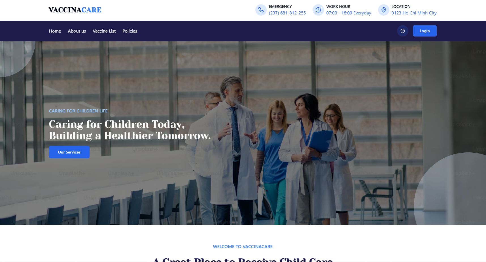
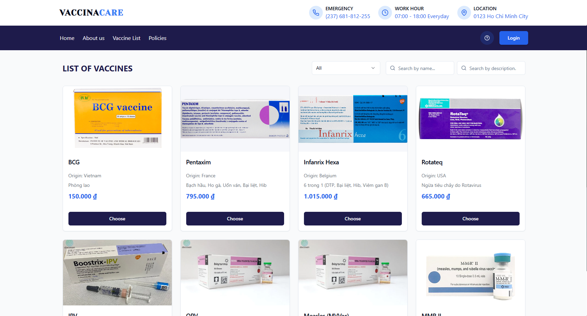
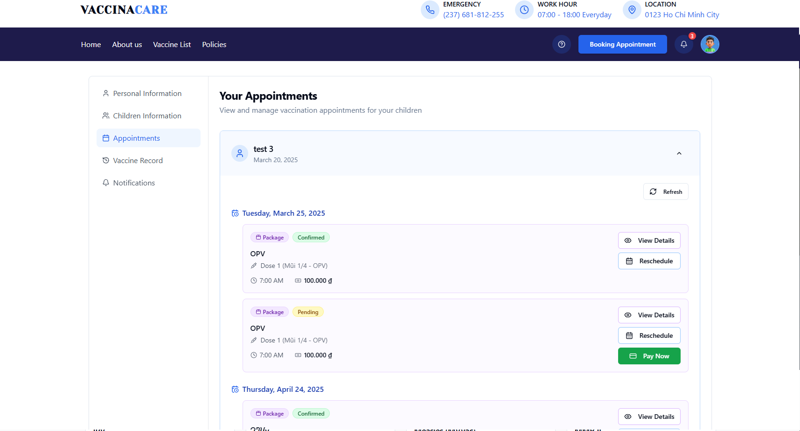

# VaccinaCare - Frontend Application


VaccinaCare is a comprehensive web application for managing vaccinations, designed to connect parents with healthcare providers for scheduling and tracking child vaccinations.

## Overview

This frontend application is built with React and TypeScript, utilizing modern web development tools and practices. It provides different interfaces for customers (parents), staff, and administrators.

## Features

### Customer Features
- **User Authentication**: Secure login and registration system
- **User Dashboard**: Manage profile and view notification
- **Child Management**: Add and manage children's profiles and medical information
- **Appointment Booking**: Schedule vaccination appointments for children
- **Vaccine Records**: Track vaccination history and upcoming schedules
- **Vaccine Catalog**: Browse available vaccines and packages with detailed information

### Staff Features
- **Vaccine Management**: Add, update, and delete vaccines
- **Vaccine Package Management**: Create and manage bundled vaccine packages
- **Appointment Review**: Process and manage customer appointments
- **Vaccine Interval Rules**: Set and manage rules for vaccine administration intervals

### Admin Features
- **User Management**: Manage staff and customer accounts
- **Policy Management**: Define and update cancellation and rescheduling policies
- **Dashboard**: View system statistics and metrics
- **Rating Management**: Monitor and manage customer feedback

## Technical Stack

- **Framework**: React with TypeScript
- **Routing**: React Router
- **State Management**: React Context API
- **UI Components**: Custom components with Tailwind CSS
- **API Communication**: Axios
- **Authentication**: JWT-based authentication
- **Styling**: Tailwind CSS with shadcn/ui components
- **Animations**: Framer Motion
- **Data Visualization**: Recharts

## Project Structure

```
src/
│
├── api/              # API service layer
│   ├── admin/        # Admin-specific API calls
│   ├── staff/        # Staff-specific API calls
│   └── ...           # Shared API services
│
├── components/       # React components
│   ├── admin-dashboard/  # Admin interface components
│   ├── staff-dashboard/  # Staff interface components
│   ├── user-dashboard/   # User interface components
│   ├── ui/               # Shared UI components
│   └── ...               # Other components
│
├── contexts/         # React contexts for state management
│   ├── AppointmentContext.tsx
│   ├── AuthContexts.tsx
│   └── ...
│
├── hooks/            # Custom React hooks
│
├── lib/              # Utility functions and helper libraries
│
├── pages/            # Page components for routing
│   ├── admin/        # Admin pages
│   ├── staff/        # Staff pages
│   ├── user/         # User pages
│   └── ...           # Shared pages
│
└── types/            # TypeScript type definitions
```

## Authentication and Authorization

The application uses a JWT-based authentication system with:
- Access tokens for API requests
- Refresh tokens for session maintenance
- Role-based access control (Customer, Staff, Admin)

## Getting Started

1. Clone the repository
2. Install dependencies:
   ```
   npm install
   ```
3. Start the development server:
   ```
   npm run dev
   ```


## Build for Production

```
npm run build
```

## Environment Setup

Create a `.env` file with the following variables:
```
VITE_API_URL=your_api_url
```

## Features in Development

- Enhanced reporting features
- Mobile application
- Integration with health records systems
- Multi-language support

## Screenshots

### Home Page


### Vaccine List


### User Dashboard


---

For more information, contact the development team.